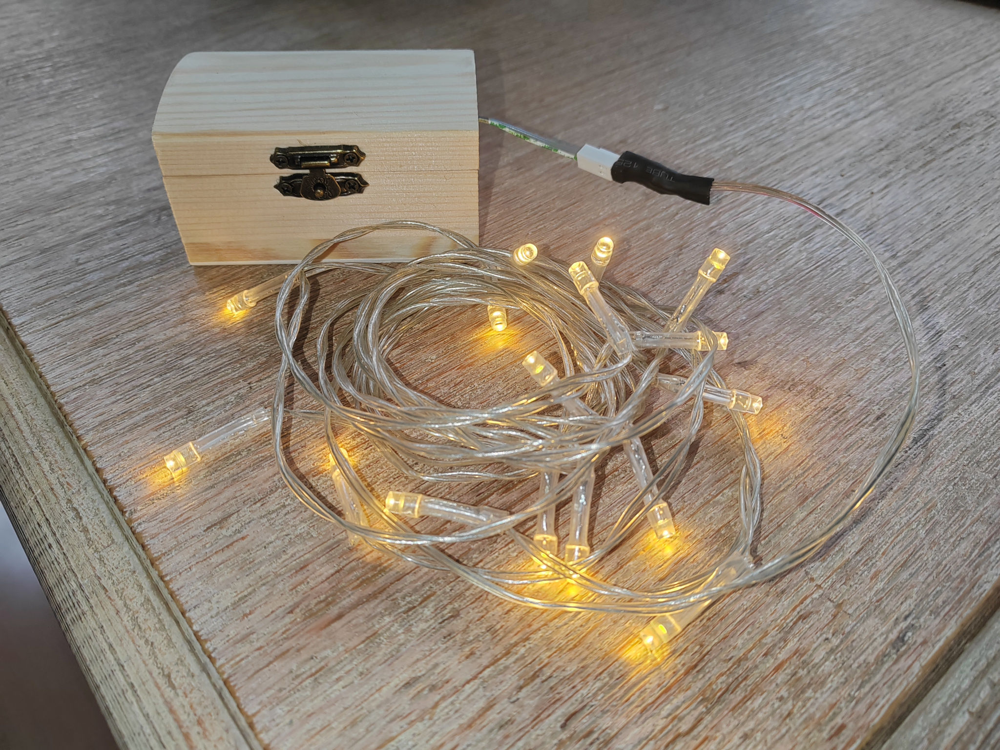
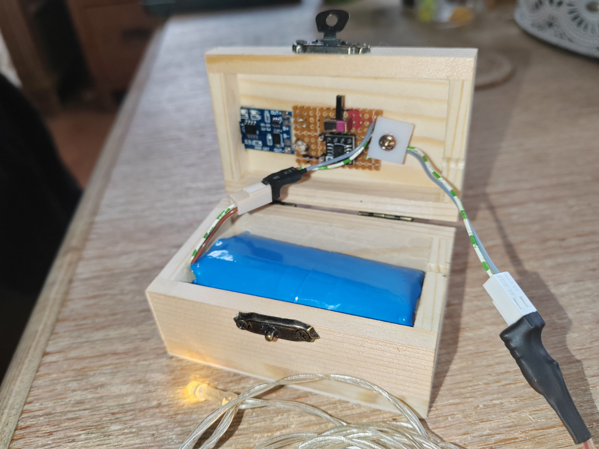
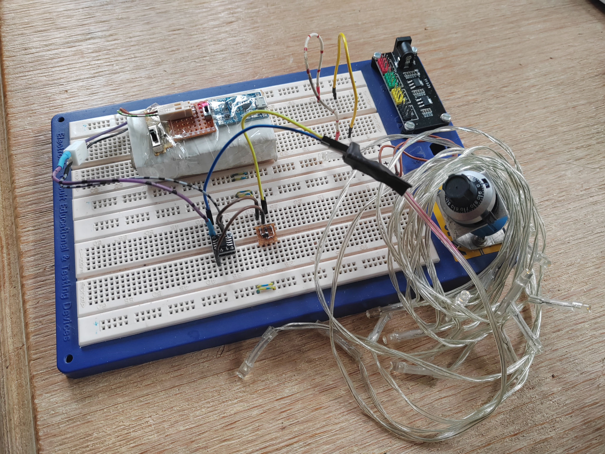
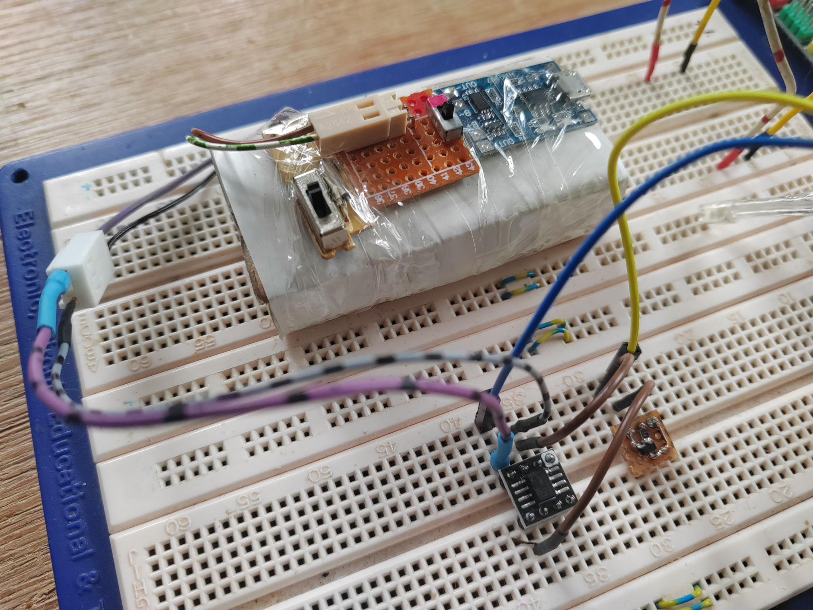
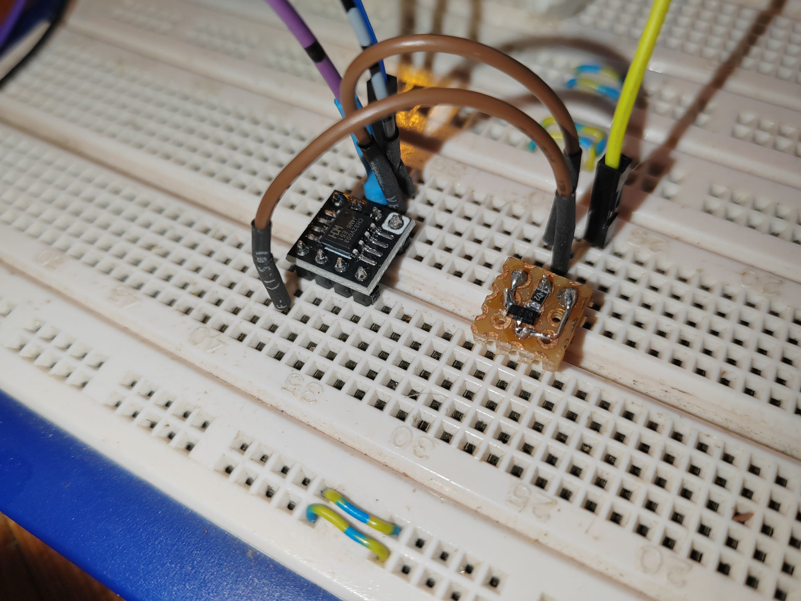
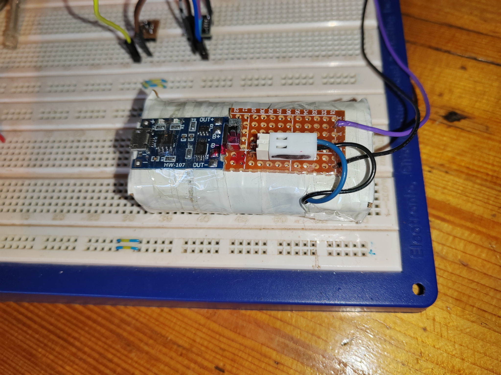

# LED-Light-Chain-Timer
A simple timer for LED chains. Switch it on and the LED chain lights for 6h, then it turns off for 18h, and so on.


Our LED string lights were going through a ton of batteries every year.
On the other side, we had plenty of old power tool batteries that would otherwise have been thrown away.
So I looked for a solution to use those batteries.

The problem with lithium batteries, however, is that they can't be completely discharged, so you need a protection circuit.

That's how I came across the TP4096 Protection Board, which also includes a charging circuit.

With the sheer number of string lights we have in use, it turned out that a timer circuit was necessary to automatically switch them on and off.

But there was no chance to timers ready-made anywhere, even though they're often found in the battery compartments of LED string lights.

That's why I built my own.

The usage of a CH32V003J4M6 allows to directly connect the schematic to a 3.6V LiIon-Battery. 

 



To make it look nice, everything is packed in a wooden box.
The left image shows an older version with a switch. It turned out, that it could be omitted.

We could hide the plug of the LED string inside the housing, and of course run the cable to the outside through a hole.

Under the black heat shrink tubing, next to the connector, is a small piece of circuit board on which resistor limits the current through the LEDs to below 10mA. I set each of the different LED strings to this current, the brightness is okay like this. The values of the resistor varies from chain to chain and is approximately between 68 and 150 ohms. 




Here is the breadboard setup shown, with a battery on which a TP4096 protection board is mounted.



On the left is the CH32v003J4N6 CPU, mounted on an adapter board. On the right is a transistor circuit, which was later omitted.



Again, the battery with protection board.

## Parts you need, the links go to Aliexpress: 
- [CH32V003J4M6](https://de.aliexpress.com/item/1005008597052746.html?spm=a2g0o.order_list.order_list_main.39.41385c5fsbANZR&gatewayAdapt=glo2deu)
- [TP4056 Protection Board ()](https://de.aliexpress.com/item/1005007980101977.html?spm=a2g0o.order_list.order_list_main.9.41385c5fsbANZR&gatewayAdapt=glo2deu)
- [Adapter Boards for the CPUs](https://de.aliexpress.com/item/1005006991835764.html?spm=a2g0o.order_list.order_list_main.4.41385c5fsbANZR&gatewayAdapt=glo2deu)
- [Programmer](https://de.aliexpress.com/item/1005005180653105.html?spm=a2g0o.order_list.order_list_main.54.41385c5fsbANZR&gatewayAdapt=glo2deu)
> [!NOTE]
> You do need the WCH LinkE! The WCH-Link (without 'E') will not work.

Don't forget some boards, where you could solder everything on :-).

If you want a CPU with more pins use this one: [CH32V003F4P6](https://de.aliexpress.com/item/1005009062407508.html?spm=a2g0o.order_list.order_list_main.64.41385c5fsbANZR&gatewayAdapt=glo2deu)

## The Software...
...is really nothing special. 

You could use the Python script to measure some timings. Connect the TX-Pin of the CPU to the RX of the programmer. Then simply activate the defines in main.h. Don't activate both lines.

```
#define USE_UART_1MIN
#undef USE_UART_60MIN
```

I hope this little project is helpful to someone.
